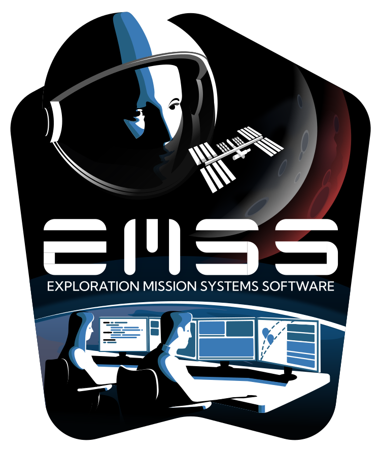
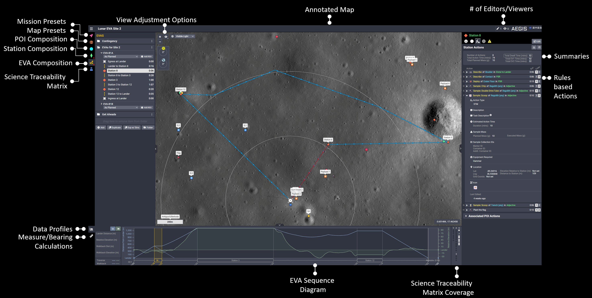
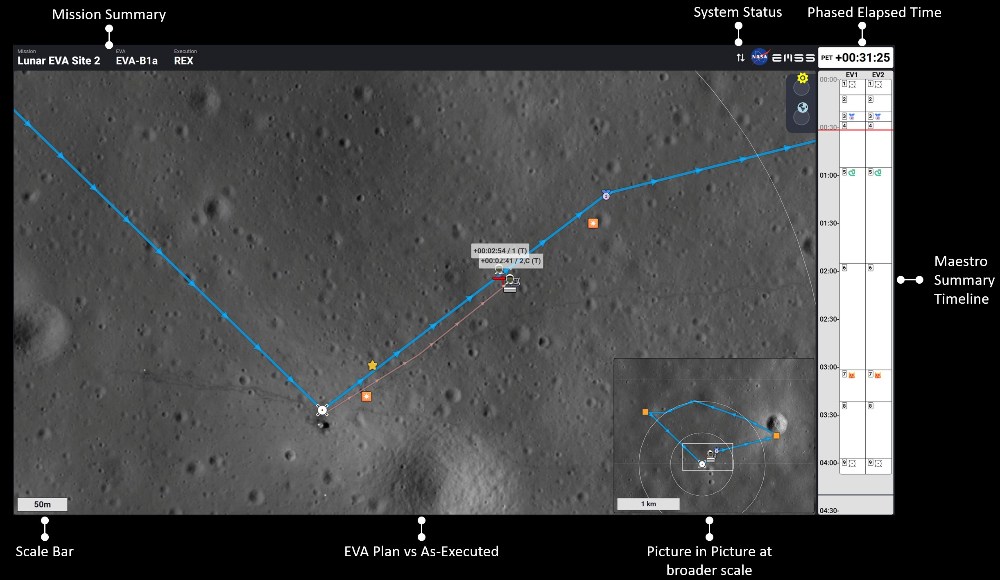

<p>
  
</p>

# Artemis EVA GIS (AEGIS)

AEGIS (Artemis EVA Geographic Information System) is a NASA planning tool aimed at enabling NASA's Artemis Extravehicular Activity (EVA) operations. AEGIS supports the creation of EVA stations, complete with activity definitions, crew assignments, contingency plans, and safety measures. AEGIS facilitates EVA planning by automating complex calculations and offering a spatiotemporal view of EVA plans. AEGIS also integrates Science Traceability Matrix (STM) objectives with spatial maps to help the flight controller community maximize the coverage of science objectives in the dynamic environment of lunar EVAs. The product's goal is to enable flight controllers, which includes the mission science team, to execute successful missions.

  

AEGIS is one of the Exploration Mission System Software (EMSS) tools built by the EMSS team at NASA Johnson Space Center to support the Flight Operations **plan, train, fly, explore** work processes. It evolved from early field-test prototypes (e.g., [JETT3](https://ntrs.nasa.gov/citations/20230010686), Fall 2022) into the prime surface mission-planning tool for EVA operations in just three years, and works alongside sibling tools such as Maestro (EVA procedure authoring and execution), [CODA](https://github.com/nasa/coda) (temporal alignment of disparate data sets), and Talky Bot (real-time voice-loop transcription).

📄 Read the paper: [Continuing Development and Enabling of Exploration Mission Systems Software](https://ttu-ir.tdl.org/items/ebd7ceef-0e7d-4f06-9829-6d2b5fd8a64b) (2026 IEEE Aerospace Conference) and [Supporting Exploration Missions by Enabling Exploration Mission System Software](https://ntrs.nasa.gov/citations/20230006625) (2023 ICES Conference)

## Screenshots

### Editor (main planning view)

The editor is the primary workspace for composing EVAs -- building stations, defining activities, assigning crew, and tracking Science Traceability Matrix coverage against an annotated lunar map.



### Dashboard

The dashboard provides a mission-level overview of EVA plans, summaries, and system status that updates live throughout mission execution



## Key Capabilities

- **EVA, station, and POI composition** -- build EVAs from stations and points of interest, each with activity definitions, crew assignments, contingency plans, and safety measures.
- **Science Traceability Matrix (STM) integration** -- plan against science objectives and visualize STM coverage to maximize the science return of each traverse.
- **Spatiotemporal planning** -- combine annotated maps, data profiles, EVA sequence diagrams, and measure/bearing calculations for a unified view of plans over space and time.
- **Automated calculations** -- traverse timing, distances, bearings, and elevation profiles are computed automatically from the underlying GIS data.
- **Real-time multi-user collaboration** -- multiple editors and viewers work on the same mission simultaneously via a collaborative editing layer.
- **Real-time execution mode** -- follow an EVA as it is flown, comparing the plan against as-executed progress.

## Map & GIS Rendering

The map is a custom [OpenLayers](https://openlayers.org/) engine purpose-built for lunar surface data. Unlike a typical web map, it does not assume a Web Mercator earth -- it renders **custom, per-mission coordinate reference systems**, including the polar projections required for Artemis' south-pole landing region.

- **Lunar south-pole projections** -- renders in a Moon-specific polar stereographic CRS rather than an earth projection. The Artemis surface projection is **South Pole Stereographic on the Moon (2015) sphere** (`IAU2000:30166`, `+proj=stere +lat_0=-90 +lon_0=0 +a=1737400 +b=1737400`, radius 1,737.4 km). The GIS data pipeline also produces the NASA projections -- Lunar Polar Stereographic (LPS, scale factor 0.994) and Lunar Transverse Mercator (LTM) -- for the grid overlay.
- **Per-mission projection config** -- each mission carries its own proj4 definition, extent, origin, and resolution set, so missions in different regions (or with different source data) render in their correct native CRS. Projections are registered at runtime via proj4; missions can also fall back to standard Web Mercator for earth-based field tests.
- **Multiple layer/source types**, mixed freely within a single mission:
  - **Raster tiles** -- TMS/XYZ tile pyramids, with custom (non-Mercator) tile grids and TMS Y-axis handling for polar projections.
  - **Cloud Optimized GeoTIFF (COG)** -- streamed and rendered on the GPU via WebGL, used for DEMs and large single-file rasters without pre-tiling.
  - **Vector** -- GeoJSON, canvas-batched for performance.
  - **Vector tiles** -- PMTiles (MVT), including ESRI-exported archives, with tile metadata read on demand.
- **Time-aware layers** -- sublayers can be bound to mission time, so the displayed imagery/data tracks the selected EVA datetime or timeline scrub position.
- **Elevation-aware planning** -- a DEM/COG elevation source drives automatically generated terrain profiles along traverses and stations.
- **Geodesic measurement** -- traverse and measurement distances/bearings are computed geodesically on the lunar sphere (not from projected geometry), so they stay accurate under polar distortion near the pole.
- **Lunar Grid Reference System (LGRS) grid overlay** -- an on-map graticule generated from the [Lunar Grid Rerference System](https://github.com/rbeyer/lgrs) grid definitions used across the Artemis program.
- **Map presets** -- saved layer stacks, ordering, opacity, blend modes, and view options that can be swapped in a single action.

### GIS Data Processing Pipeline

AEGIS includes a GIS data processing pipeline that can generate the full set of map assets for **any region of the Moon** given a DEM (Digital Elevation Model) and a NAC (Narrow Angle Camera) mosaic as input. From those inputs it produces the cap-grid raster tile pyramids, Cloud Optimized GeoTIFFs, PMTiles vector tiles (including DEM-derived elevation contours), and LGRS grid definitions that AEGIS renders -- reprojecting the source data into the appropriate lunar CRS (south-pole stereographic) along the way. It can also register the generated products directly onto a running AEGIS server over HTTP (mission projection/DEM/lander fields, header layers, sublayers, and the active grid), so no manual admin import is required.

## Setup Outside of NASA

> **Note:** The [First-Time Setup within NASA](#first-time-setup-within-nasa) instructions below assume access to NASA's internal infrastructure (EMSS dev servers, the AEGIS Box asset source, prod database dumps, and internal package registries). The steps in this section provide a self-contained path to run AEGIS with the Apollo 14 demo mission outside of that environment.

### Prerequisites

1. Clone this repo.
2. Install JavaScript dependencies **without the private packages**: `npm run setup:public`
   (equivalent to `npm install --omit=optional`). AEGIS depends on a few private
   `@emss/*` packages hosted on NASA's internal registry; they are declared as
   optional and are only needed at build time. `setup:public` skips them and then
   substitutes the local stand-ins in [`emss-fallback/`](emss-fallback/README.md).
   (AEGIS developers with NASA registry access run plain `npm i` and get the real
   packages — see [First-Time Setup within NASA](#first-time-setup-within-nasa).)
3. Create your `.env` file by copying the template: `cp .env.template .env`. The
   placeholder values let the app run locally; Box.com and EMSS/Maestro integrations
   will not work with them, but local development (including the Apollo 14 demo) does
   not need them.
4. Start PostgreSQL: `npm run docker:services:public`.

### Step 1: Seed the database

Instead of importing a NASA prod database dump, populate your fresh local database with a
self-contained **Apollo 14** demo mission (a handful of POIs, stations, and an EVA with its
traverses, plus a few map layers):

```bash
npm run seed:demo
```

This runs, in order:

1. `migration:fresh` -- drops, recreates, and seeds the relational schema (creates the `admin` /
   `admin` and `guest` / `guest` users via the MikroORM seeder).
2. `automerge:seed:build` + `automerge:seed` -- creates the Apollo 14 mission **Automerge document**
   (all collaborative entity data lives in Automerge, not the relational tables) plus its map layers.

> **Note:** The demo mission references NAC ortho / hillshade tile layers and vector layers by path.
> The layer records are created, but the tiles themselves are separate GIS assets -- see
> [Step 2: Download map assets](#step-2-download-map-assets) below for obtaining and installing them.
> Without them the map renders the mission geometry over an empty basemap.
>
> Re-running `automerge:seed` on its own is safe: it detects an existing "Apollo 14" mission and exits
> without creating a duplicate.

### Step 2: Download map assets

The seeded Apollo 14 mission references GIS map products (tile layers, vector layers, and a DEM) that must be present on disk for the map to render. Download the pre-packaged asset bundle and extract it into your static assets folder.

1. Create the static assets folder next to the repo (the default location configured in `.env` for local dev):
   ```bash
   mkdir ../aegis_static
   ```
2. Download the Apollo 14 GIS demo data bundle:
   ```bash
   curl -L -o AEGIS_Apollo_14_GIS_demo_data.zip \
     https://ares-aegis.s3.us-gov-west-1.amazonaws.com/AEGIS_Apollo_14_GIS_demo_data.zip
   ```
3. Extract it into the `missionFiles` subdirectory of the static folder:
   ```bash
   unzip AEGIS_Apollo_14_GIS_demo_data.zip -d ../aegis_static/missionFiles
   ```
   The zip unpacks into the expected directory structure that AEGIS layer paths reference, so no further reorganisation is needed.

> **Note:** The `STATIC_DIR` environment variable (set to `../aegis_static` by default for local dev in `env.config.ts`) controls where AEGIS looks for these files. If you configured a different path, extract the zip there instead.

### Step 3: Run the app

```bash
npm run dev
```

Open [http://localhost:4000](http://localhost:4000) and log in as `admin` / `admin`. The Apollo 14 mission should open with the map layers rendering correctly.

## First-Time Setup within NASA

> **Note:** The instructions in this section and below are for setup **within NASA**, and depend on internal infrastructure. For running AEGIS outside of NASA, see [Setup Outside of NASA](#setup-outside-of-nasa) above.

Internal references and environments:

- Wiki: https://wiki.jsc.nasa.gov/fod/index.php/Artemis_EVA_GIS
- Production: https://aegis.fit.nasa.gov/
- Integration: https://aegis-int.fit.nasa.gov/
- Development: Any EMSS dev server (see below)

EMSS dev servers all have element names, and are:

- https://carbon-emss-dev.fit.nasa.gov
- https://gold-emss-dev.fit.nasa.gov
- https://iron-emss-dev.fit.nasa.gov
- https://neon-emss-dev.fit.nasa.gov
- https://oxygen-emss-dev.fit.nasa.gov

We need to setup the local environment before spinning up the app.

### Step 1: Setting up the Local Environment

1. Clone this repo to your machine
2. Create a folder for static assets. This is the location where the hundreds of thousands of GIS map assets will be stored.
   - Make an empty folder called `aegis_static` that is next to the folder the AEGIS project was cloned to.
     - For example, if you cloned the AEGIS repo to `C:\aegis`, make an empty folder at `C:\aegis_static`
3. From within this repo, install JavaScript dependencies: `npm i`
4. Get the secret values from another AEGIS developer and paste them into a new file called `env.secret.ts`
5. Create a `./.env` file by running `npm run make-dotenv` in the terminal.
6. Run `./scripts/make-dev-ssl-cert.sh` in a terminal to setup a self-signed certificate.
7. **Workstation Admin privileges required:** Add `127.0.0.1 aegis-local.fit.nasa.gov` to your "hosts" file.
   1. Windows: Open the start menu, type "notepad", right-click on "Notepad" and select "open as administrator". In Notepad go to `C:\Windows\System32\drivers\etc`, show all files, and open the `hosts` file.
   2. Mac: Edit `/etc/hosts`
   3. Content to add at the bottom of the file (add CODA/Maestro/Labs while you're at it):
      ```
      127.0.0.1 aegis-local.fit.nasa.gov
      127.0.0.1 coda-local.fit.nasa.gov
      127.0.0.1 maestro-local.fit.nasa.gov
      127.0.0.1 talkybot-local.fit.nasa.gov
      127.0.0.1 emss-labs-local.fit.nasa.gov
      ```
8. Import a Prod Database Dump
   1. Download a DB dump sql file from the `z:db-export:prod` job in one of the AEGIS pipelines
      1. Visit https://eegitlab.fit.nasa.gov/emss/aegis/-/pipelines
      2. Under the Actions column, download a job artifact for `z:db-export:prod`
      3. The artifact file may be zipped. If so, unzip it. You should end up with a plain text SQL file
      4. Rename the plain text SQL file to `aegis.sql`
   2. If a `.local/db-init` folder does not exist in this repo, create it
   3. Copy/move `aegis.sql` to `.local/db-init/aegis.sql`
   4. If a `.local/database` directory already exists in this repo, delete it
9. Perform steps for either **Step 2: Option 1: Development with service containers** or **Step 2: Option 2: Development with No docker** or **Step 2: Option 3: Preview a Fully Dockerized Application** below.

### Step 2, Option 1: Development with service containers (PREFERRED)

This is for doing local development with PostgreSQL in Docker. Elevation profiles are sampled by
the Node API directly from mission GeoTIFFs under `STATIC_DIR`.

1. Run Docker only starting the database service: `npm run docker:services`
2. Run `npm run dev` to start the API and frontend.
3. Open [http://localhost:4000](http://localhost:4000) with your browser (note lack of https).
4. Continue to **Step 3: Setting up GIS products for local development**

### Step 2, Option 2: Development with No Docker

This is for doing local development when you don't have Docker installed on your laptop yet.

1. Download PostgreSQL Binaries from the official url https://www.enterprisedb.com/download-postgresql-binaries
2. Choose the latest binaries from installer version for Win x86-64 for Windows Operating System. Current latest version available is 17.4. This will be a higher version than the docker container AEGIS uses, but this shouldn't matter.
3. Extract the zip to a location like `C:\Users\{username}\apps\`
4. Add the directory `C:\Users\{username}\apps\pgsql\bin` to the User Environment Variables for `{username}`. Ensure that you do not add it to the System Variables. After adding the pgsql bin directory's path to User Environment variables, click OK.
5. Tests
   1. Test the server installation by opening a new terminal window and typeing `postgres -V`. If postgres is working it will return the version number
   2. Test the client version with `psql -V`
6. Use `gitbash` to run the scripts in `/scripts/non-docker` to start/stop the database
   - To start `scripts/non-docker/start-aegis-db.sh`
     - On first start it will import the sql dump you placed in `db-init` above
   - To stop `scripts/non-docker/stop-aegis-db.sh`
   - **NOTE:** you should use a different `gitbash` session than the one you use to run npm since ctrl-c will quit postgres as well as node if both are run in the same `gitbash` session.\
7. Run `npm run dev` to bring up local env using the newly running DB.
8. Continue to **Step 3: Setting up GIS products for local development**

### Step 2, Option 3: Preview a Fully Dockerized Application

This is for previewing AEGIS in a full docker setup as it would be configured on the pipeline

1. Run Docker for production preview. This will start the service containers plus additional containers: `npm run docker:preview`
2. Open [https://aegis-local.fit.nasa.gov](https://aegis-local.fit.nasa.gov) with your browser.
3. Due to an HSTS policy, the browser will display a security issue and will not let the page load. In chrome, type "thisisunsafe" on the page like a cheat code.

To stop, run `sh appcompose preview down`.

### Step 3: Setting up GIS products for local development

Setup local environment using the instructions above before performing the following.

#### Option 1: Download assets using the AEGIS admin interface

- The `https://aegis-local.fit.nasa.gov/admin` interface allows AEGIS admins to download asset zips from the AEGIS Box source folder to the AEGIS GIS products location.
- Use the interface itself to download assets as needed to match the missions in the system (from the prod dump of `aegis.sql`)
- Example for Apollo 14 mission:
  1.  Head to `Missions`.
  2.  Under `Apollo 14` select `Edit Layers`.
  3.  Under the **Manage files in the /Layers folder for this mission** section, there is a **Download from Box** section.
  4.  Click through to `AEGIS Zips > z_Archived_and_Inactive_Missions > Apollo 14 > Data` (NOTE: the exact path may have changed! If so, ask around.)
  5.  Click the download button next to `NAC_DTM_APOLLO14.zip`
      - Note: you won't see a download start in your browser. The downloads will show under `Directory Listing` and will be visible in the `../aegis_static` folder created during the initial setup
  6.  Go back to `AEGIS Zips > z_Archived_and_Inactive_Missions > Apollo 14 > Layers`
  7.  Download all layers. Again, they will be automatically unpacked to the correct locations within `../aegis_static`

#### Option 2: Manual install assets for Apollo 14 mission

1. Download the [Apollo 14 zips](https://nasa-ext.app.box.com/s/kpisqjexem99biar7h21xt773apcvcm2/folder/198248141077) and extract the contents anywhere on your computer.
2. Open [https://aegis-local.fit.nasa.gov/admin](https://aegis-local.fit.nasa.gov/admin) or [http://aegis-local.fit.nasa.gov:4000/admin](http://aegis-local.fit.nasa.gov:4000/admin) depending on whether you started the full docker-compose or just the database.
3. Under `Missions` select `Add/Edit Missions`.
4. Under the Mission select `Edit Layers`
5. Under `Manage files in the /Layers folder for this mission` section, select browse and navigate to the `Apollo_14/Layers` folder you extracted in step 1.
6. For each zip file in `Apollo_14/Layers` submit and upload them.
7. Under the Mission select `Edit Mission`
8. Under `Manage files in the /Data folder for this mission` section, select browse and navigate to the `Apollo_14/Data` folder you extracted in step 1.
9. Select `NAC_DTM_APOLLO14.zip` and submit and upload it for elevation data.
10. Add `{"dem":"Data/NAC_DTM_APOLLO14.TIF","resolution":10}` to `Measure` object in `mission config.s`

## Helpful App Management Procedures

**Run Tests**

You've made code changes and you want to make sure the application still acts as expected. Make sure you add / update tests to reflect the new behavior(s) that you've coded.

```sh
npm run test:all
```

**Apply migrations**

You've made changes to the database schema or automerge schema and now you want to apply them.

```sh
npm run migration:up
npm run schema:create
npm run automerge:migration:build
npm run automerge:migration
```

**Create or reset to a fresh database (with prod data)**

Refreshing your local database to match prod is a three step process:

1. Stop the aegis database container
2. Perform **Step 1.8** from above
3. Restart the aegis database container
4. If there are any db changes to apply on your current branch, run `npm run migration:up`

The command line procedure would look as follows:

```sh
# stop the aegis database container
sh appcompose services down

# perform step 1.8 in its entirety

# bring the database container back up
npm run docker:services

# run local migrations if necessary
npm run migration:up
```

### Postgres Version Upgrades

When the Postgres version is updated in `docker-compose.yml`, the database must be migrated. The procedure differs by environment.

> **Note on PostGIS:** AEGIS previously ran on a `postgis/postgis` image. It has been migrated to plain `postgres:17`. Historical database dumps may contain PostGIS extension DDL (`CREATE EXTENSION postgis`, etc.) that plain Postgres cannot execute. All dump/import tooling (CI scripts, `upgrade-db.sh`, and `load-sql-dump.mjs`) automatically strips this DDL before importing. Note that the strip only removes `CREATE/COMMENT EXTENSION` lines. A dump produced before `--exclude-schema=tiger/topology` was added to the export job may still contain PostGIS schema or function DDL that plain Postgres cannot execute -- use a current export from `z:db-export:prod` rather than a cached historical artifact when possible.

**For Dev Environments (e.g., gold, iron, etc.):**
Dev environments are upgraded manually via CI jobs because we cannot guarantee AEGIS is deployed on every dev server (making an automated in-place upgrade unreliable).

1. Deploy to the dev environment (e.g., gold)
2. Run the manual CI job `z:db-export:prod` to export the production database (PostGIS DDL is stripped automatically during export)
3. Run the manual CI job `z:db-import:<env>` to import the database into the dev environment

To test the upgrade script itself on gold without a full deploy, un-comment and use the manual CI job `test-db-upgrade:gold`.

**For Integration and Production:**
Upgrades run automatically on every deployment via [`scripts/upgrade-db.sh`](./scripts/upgrade-db.sh). The script:

1. Reads the target Postgres major version from `docker-compose.yml`
2. Checks the version currently running in the database container
3. If an upgrade is needed: dumps the database (stripping PostGIS DDL), stops and removes the old container, removes the old data directory, and places the dump in the init directory so the new container imports it on first boot
4. If no upgrade is needed: exits immediately with no changes

**Create a blank database (no data)**

This is a completely empty database. Schemas have been applied, but don't expect anything other than a default user to exist.

You are unlikely to want a completely blank database for day-to-day development. However, it could be useful for situations where major changes to the database / database schema are being made and you want as clean of an environment as possible to test.

1. Stop the database container
2. Delete `.local/database` and `.local/db-init`
3. Restart the database container
4. Run migrations with `npm run migration:fresh`

The command line procedure would look as follows:

```sh
sh appcompose services down
rm -rf .local/database
rm -rf .local/db-init
npm run docker:services
npm run migration:fresh
```

## Helpful Docker CLI Commands

```bash
# List all containers.
docker container list

# Viewing container logs in follow mode
docker logs <container name> -f

# Restart individual services
docker restart <container name>
```

## Load Testing

The pipeline is setup to allow you to run a load test on the various EMSS dev servers, and the `int` servers. Speaking generally, the load test will start up a bunch of worker threads that will connect to the dev environment only via web-sockets. Each worker will maintain a state of the redux store and appropriately dispatch changes as they are received via sockets. At the end of the test, all of the workers will report back with a hash of the final redux store state for comparison with all other clients. If any client missed messages, was corrupted, or has a mis-matched store for any reason, the job will fail.

Self signed certs are allowed in order to run the load test in the local environment. This is configured using the environment variable `NODE_TLS_REJECT_UNAUTHORIZED` in the load test, and also in the socket configuration via the `rejectUnauthorized` property. This should never be allowed on production.

### To start a load test in the pipeline:

1.  Deploy the application to the dev environment
2.  Run the `setup-load-test` job
3.  Start the `run-load-test` job. The load test will run for about 3-ish minutes. Once the test is going, navigate to the dev environment in your browser and start performing actions that cause socket emits. Note that you should see the AEGIS visitor count increase as load test workers connect.
4.  Once the duration has timed out, return back to the job in the pipeline to view the pass/fail results.

### To start a load test locally:

1. Build and run the full docker setup via `npm run docker:preview:rebuild` and `npm run docker:preview`
2. Add the `loadtest` username and password (from your `.env` file) manually to the DB through the AEGIS user interface.
3. Make sure you have an updated local build of the load test by running `npm run test:loadtest:build`
4. Start the load test in the terminal `npm run test:loadtest https://aegis-local.fit.nasa.gov`
5. The load test will run for about 3-ish minutes. Once the test is going, navigate to `https://aegis-local.fit.nasa.gov` in your browser and start performing actions that cause socket emits. Note that you should see the AEGIS visitor count increase as load test workers connect.
6. Once the duration has timed out, review the results in the terminal
