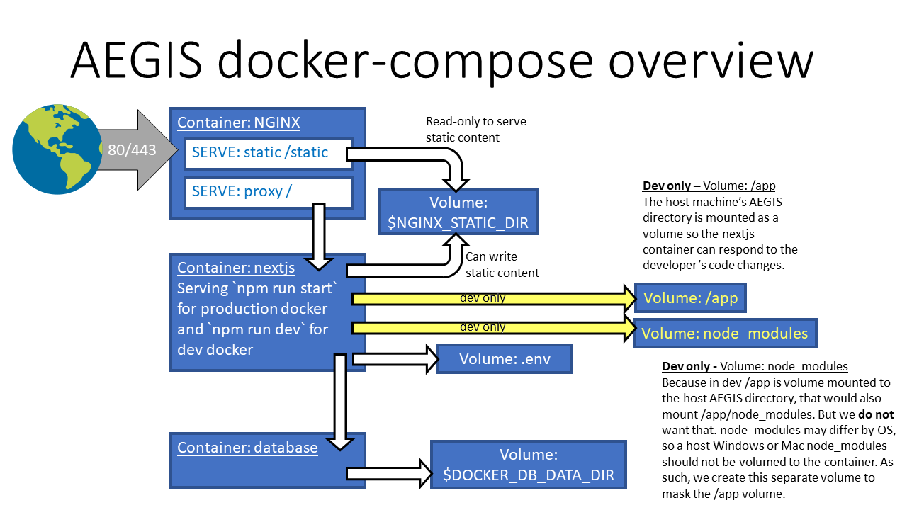

# AEGIS Docker Compose Setup



## Production

Production setup uses `docker-compose.yml` without any overrides and pulls the images from GitLab container registry. Which image to pull is determined by the `.env` vars `DOCKER_IMAGE_NGINX` and `DOCKER_IMAGE_NEXTJS`. To pull these, you'll need to create a token and authenticate with GitLab.

Images available in the GitLab registry are like: `eegitlabregistry.fit.nasa.gov/emss/aegis:(nginx|nextjs)-(dev|int|prod)`. Since the images are updated in the registry on each build, you will need to `docker-compose pull` to get newer images prior to doing `docker-compose up -d`.

There is no special `npm run ...` command for this because (a) typing `docker-compose up -d` is simple enough and (b) most people probably won't be running this locally. In contrast, the `npm run docker:dev` and `npm run docker:preview` commands are much simpler than the `docker-compose` commands they run.

## Preview

To run a production-like setup without pulling containers from GitLab, you can run `npm run docker:preview` to build and run the images locally. This uses `docker-compose.yml` and overrides with `docker-compose.preview.yml`.

To forcibly rebuild the base images run `npm run docker:preview:rebuild`, which can be necessary sometimes to avoid caching. After rebuild, then run `npm run docker:preview`.

## Development

To run a developer setup do `npm run docker:dev`. This uses `docker-compose.yml` overridden with `docker-compose.dev.yml`. The major difference from production is that the Next.JS container uses a volume to attach to the host machine's AEGIS directory, so that changes the developer makes (their machine is the host machine) are reflected on the container. The container internally runs `npm run dev` versus the production `npm run start`.

To forcibly rebuild the base images run `npm run docker:dev:rebuild`, which can be necessary sometimes to avoid caching. After rebuild, then run `npm run docker:dev`.

### Watching host files but not node_modules

In order to watch for files changing on the host (the developer's computer), the AEGIS directory on the host needs to be mounted as a volume on the containers. Then changes made on the host will also be seen by the containers. However, we _do not_ want to copy `node_modules` from the host to the containers because the host is very likely a different operating system than the containers. As such, a separate volume is setup for `node_modules` that is _not_ shared with the host, such that when `npm install` is run the `node_modules` are specific to the container.

The following articles may explain some of the above concepts:

- https://medium.com/@kartikio/setup-node-ts-local-development-environment-with-docker-and-hot-reloading-922db9016119
- https://www.freecodecamp.org/news/how-to-enable-live-reload-on-docker-based-applications/

## Docker-compose version

AEGIS `docker-compose.yml` has:

```yaml
depends_on:
  database:
    condition: service_healthy
```

Typically `depends_on` is an array of strings, e.g. `depends_on: ['database']`. In order to use the object syntax we must use docker-compose file spec version 3.9 (the current latest version). This means you must have a recent version of Docker installed, and on Linux you need to do `docker compose CMD` versus `docker-compose CMD`. For some reason the `docker-compose CMD` version does not allow the very latest spec.
